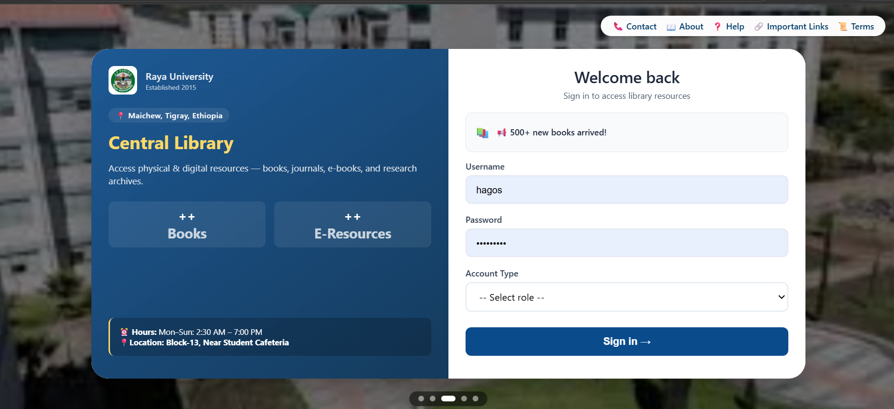
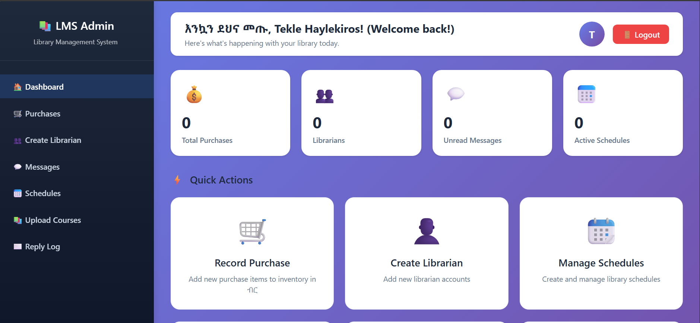
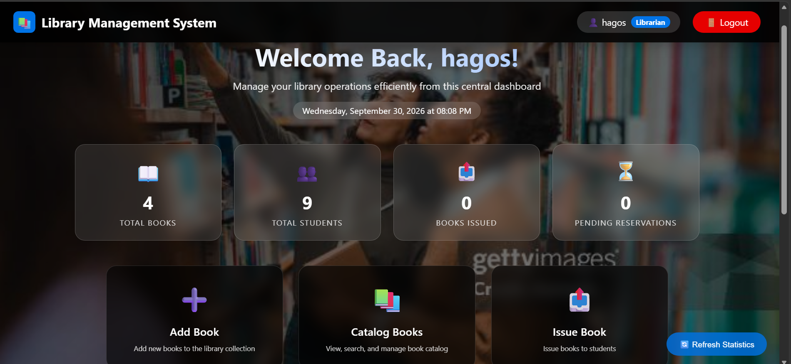
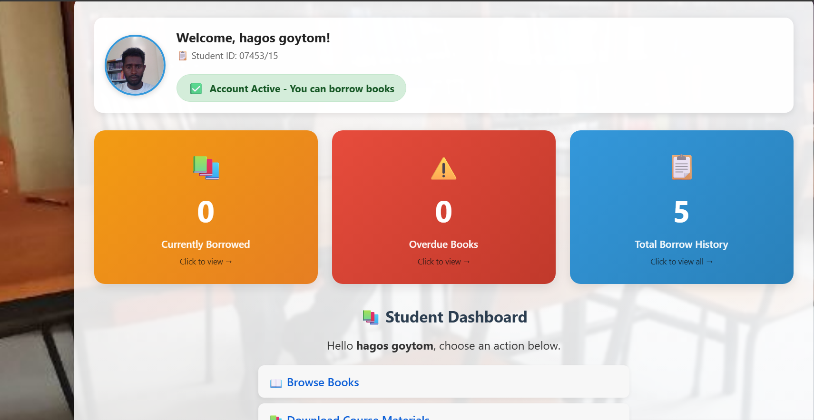
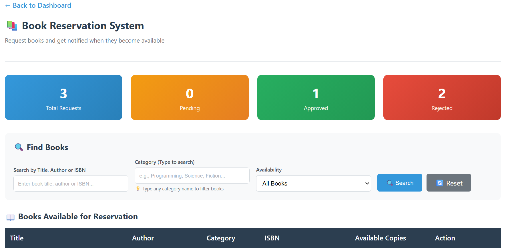

# 📚 Library Management System

A web-based **Library Management System** developed to simplify and automate library operations. The system provides separate interfaces for students, librarians, and administrators and supports book management, borrowing and returning, reservations, fines, course materials, reports, and email notifications.

---

## 👨‍💻 Developer

**Hagos Goytom Hadis**  
Information Technology Graduate

- 📧 **Email:** hagosgoytom670@gmail.com
- 💻 **GitHub:** https://github.com/hagosgoytom670-art
- 📂 **Repository:** https://github.com/hagosgoytom670-art/library-management-system

---

## 🎯 Project Overview

The Library Management System is designed to provide a centralized platform for managing library resources and services.

The system supports three main user roles:

- 👨‍🎓 **Student**
- 📚 **Librarian**
- 👨‍💼 **Administrator**

Each role has different permissions and functionalities based on its responsibilities within the library.

---

## 🚀 Features

### 👨‍🎓 Student

Students can:

- Register and log in to the system
- Browse available books
- Search for books
- Borrow books
- Return books
- View borrowing history
- Reserve books
- View fines
- View payment history
- Download course materials
- Manage their profile

---

### 📚 Librarian

Librarians can:

- Add new books
- Edit book information
- Delete books
- Check book availability
- Issue books to students
- Process returned books
- Manage book reservations
- Check student borrowing records
- Manage librarian schedules
- Generate library reports
- Process fines and payments
- Send email notifications

---

### 👨‍💼 Administrator

Administrators can:

- Manage students
- Manage librarians
- Manage system users
- Upload course materials
- Manage library information
- Generate reports
- View system activities
- Manage administrative functions

---

## 🛠️ Technologies Used

| Technology | Purpose |
|---|---|
| **PHP** | Backend development |
| **MySQL** | Database management |
| **HTML5** | Web page structure |
| **CSS3** | User interface styling |
| **JavaScript** | Client-side functionality and validation |
| **Bootstrap** | Responsive user interface |
| **PHPMailer** | Email notifications |
| **XAMPP** | Local development environment |
| **Git & GitHub** | Version control and project hosting |

---

## 🗄️ Database

The system uses **MySQL** as its database management system.

The database stores information including:

- User accounts
- Students
- Librarians
- Books
- Borrowing records
- Reservations
- Fines
- Payments
- Course materials
- Library activities

The database schema is available at:

```text
sql/schema.sql
```

---

## 🔐 User Roles

The system uses role-based access control.

```text
                    Library Management System
                              │
              ┌───────────────┼───────────────┐
              │               │               │
           Student         Librarian       Admin
              │               │               │
          Borrow Books     Manage Books    Manage Users
          Reserve Books    Issue Books     Manage System
          View Fines       Return Books    Upload Materials
          View History     Reports         Reports
```

---

## ⚙️ Installation

### 1. Clone the Repository

Open your terminal and run:

```bash
git clone https://github.com/hagosgoytom670-art/library-management-system.git
```

### 2. Move the Project

Place the project inside the XAMPP `htdocs` directory:

```text
C:\xampp\htdocs\lmsPro
```

### 3. Start XAMPP

Open XAMPP Control Panel and start:

```text
Apache
MySQL
```

### 4. Create the Database

Open phpMyAdmin:

```text
http://localhost/phpmyadmin
```

Create a database named:

```text
library_system
```

### 5. Import the Database

Select the `library_system` database and import:

```text
sql/schema.sql
```

### 6. Configure Database Connection

The database connection is configured in:

```text
db.php
```

Default XAMPP configuration:

```php
<?php
$host = "localhost";
$user = "root";
$pass = "";
$dbname = "library_system";

$conn = new mysqli($host, $user, $pass, $dbname);

if ($conn->connect_error) {
    die("Connection failed: " . $conn->connect_error);
}
?>
```

### 7. Open the Application

After starting Apache and MySQL, open:

```text
http://localhost/lmsPro/
```

---

## 📂 Project Structure

```text
lmsPro/
│
├── api/
│   ├── dashboard_stats.php
│   └── recent_activity.php
│
├── assets/
│   ├── css/
│   ├── images/
│   └── js/
│
├── dashboards/
│   ├── admin.php
│   ├── librarian.php
│   └── student.php
│
├── includes/
│   ├── auth.php
│   ├── header.php
│   ├── footer.php
│   ├── about.php
│   ├── help.php
│   └── terms.php
│
├── modules/
│   ├── admins/
│   ├── librarians/
│   └── students/
│
├── screenshots/
│   ├── Admin_DashBoard.png
│   ├── Librarian_DashBoard.png
│   ├── Loginpng.png
│   ├── Request_Reaervation.png
│   └── Student_Dashboard.png
│
├── sql/
│   └── schema.sql
│
├── db.php
├── index.php
├── login.php
├── logout.php
├── nav.php
└── README.md
```

---

## 📸 Screenshots

### 🔐 Login Page



---

### 👨‍💼 Admin Dashboard



---

### 📚 Librarian Dashboard



---

### 👨‍🎓 Student Dashboard



---

### 📖 Book Reservation



---

## 📚 Main Modules

### Authentication

- User login
- Student registration
- Password management
- Role-based authentication
- Logout functionality

### Book Management

- Add books
- Edit books
- Delete books
- Search books
- Check availability
- Book catalog

### Borrowing System

- Issue books
- Return books
- Borrowing history
- Due dates
- Fine calculation

### Reservation System

- Student book reservation
- Librarian reservation management
- Reservation status tracking

### Course Materials

- Upload course materials
- Organize learning resources
- Download materials
- Course and chapter organization

### Reporting

- Borrowing reports
- Library reports
- Student records
- System activity information

### Notifications

- Email notifications
- Borrowing notifications
- Return notifications
- Reservation-related notifications

---

## 🔒 Security

The project uses role-based access control to restrict access to different parts of the system.

Sensitive information and generated files are excluded from version control using `.gitignore`.

Excluded items include:

```text
.env
uploads/
modules/admin/uploads/
modules/admins/uploads/
vendor/
.vscode/
*.log
```

---

## 📧 Email Notifications

The system uses **PHPMailer** to support email communication.

Email functionality can be used for events such as:

- Book issuance
- Book returns
- Overdue notifications
- Other library-related notifications

---

## 💻 Local Development Environment

This project was developed and tested using:

```text
XAMPP
PHP
MySQL
Apache
```

The application can be run locally through:

```text
http://localhost/lmsPro/
```

---

## 📈 Future Improvements

Possible future improvements include:

- Online deployment
- Cloud database integration
- Advanced dashboard analytics
- Mobile application
- Online payment integration
- Automated overdue reminders
- Improved reporting and data visualization
- REST API integration

---

## 🎓 Project Purpose

This project was developed as an academic and professional portfolio project to demonstrate practical skills in:

- Web application development
- PHP programming
- MySQL database design
- Front-end development
- JavaScript programming
- Authentication
- Role-based access control
- Database integration
- Email integration
- Git and GitHub

---

## 📄 License

This project was developed as an academic and professional portfolio project.

---

## ⭐ Repository

If you are interested in the project, you can explore the complete source code here:

**GitHub Repository:**  
https://github.com/hagosgoytom670-art/library-management-system

---

## 📬 Contact

**Hagos Goytom Hadis**

📧 Email: hagosgoytom670@gmail.com

💻 GitHub:  
https://github.com/hagosgoytom670-art

